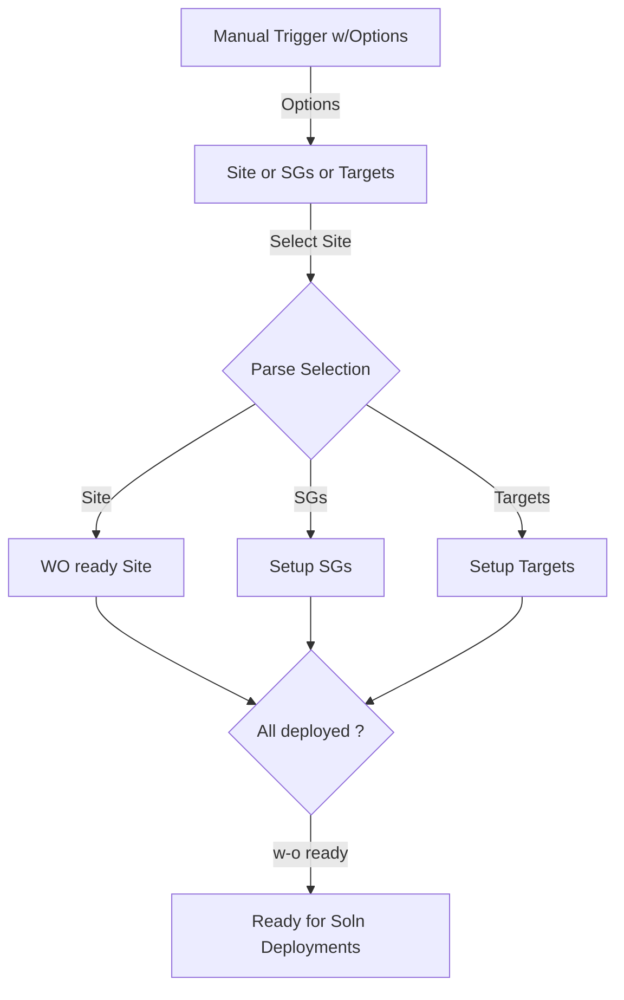
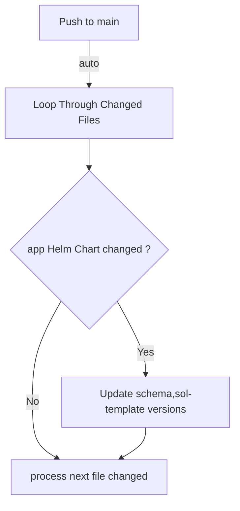
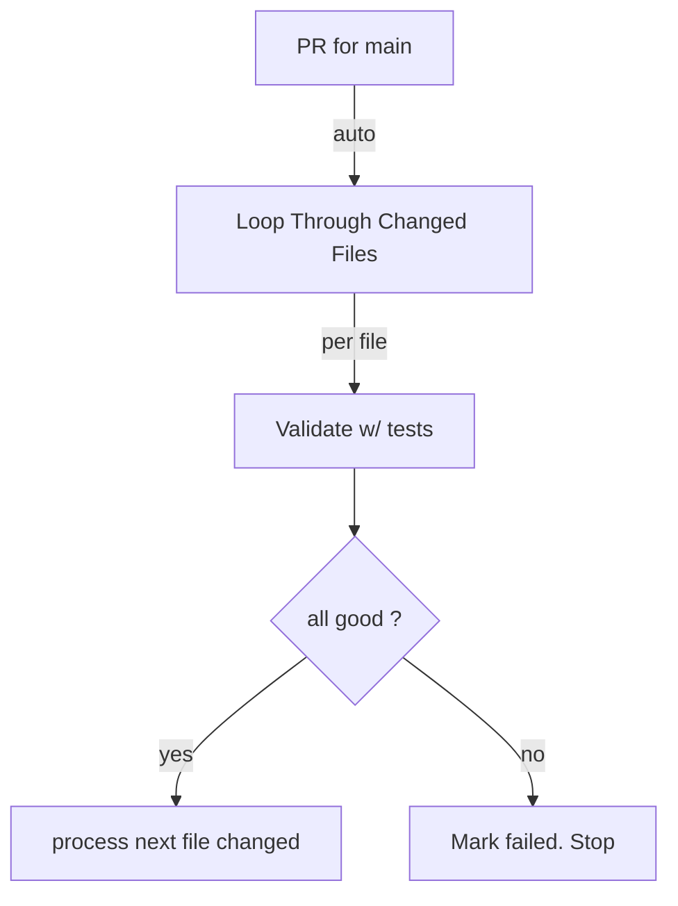
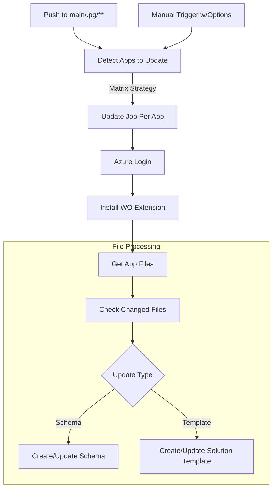
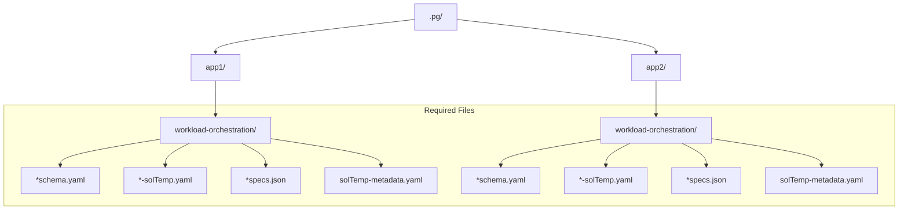
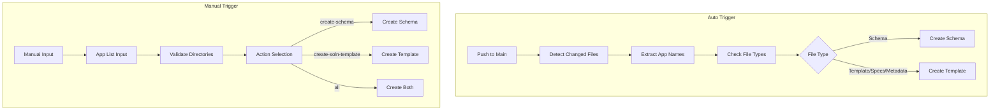

# workloadorchestration-templates
# GitHub Actions Workflow Documentation

## Overview

This repository contains GitHub Actions workflows that automate various Azure Arc Workload Orchestation operations. 

- **wo_infra_deploy**: automates the setup and deployment of sites, targets and service groups and ready it for application deployments
- **cm_onboarding**: automates the process of creating workload orchestration ARM artifacts from configurations for multiple applications.
- **wo_syncversion**: automates the sync'ing version of wo artifacts with the application Helm Chart version
- **wo_pullreq**: automates the process of identifying all the changed files in a pull-request and optionally validating them

## Initial Setup

Before using these workflows, you need to configure Azure authentication using a User-Assigned Managed Identity (UAMI) and federated identity credentials.

### 🔐 Configure Federated Identity Credential for GitHub Actions (Azure Portal)

This guide walks you through configuring a **federated identity credential** in the **Azure Portal** so your GitHub Actions workflows can authenticate to Azure using a **User-Assigned Managed Identity (UAMI)** — without storing secrets.

> Based on [Microsoft Learn documentation](https://learn.microsoft.com/en-us/entra/workload-id/workload-identity-federation-create-trust-user-assigned-managed-identity)

#### Prerequisites

- An existing **User-Assigned Managed Identity (UAMI)** in Azure
- A GitHub repository
- Access to the **Azure Portal**
- Contributor or Owner access to relevant Azure resources

#### Step-by-Step Instructions

##### 1. Open the Managed Identity in Azure Portal

1. Go to [https://portal.azure.com](https://portal.azure.com)
2. In the top search bar, type **User assigned identities**
3. Select your UAMI from the list

#####  2. Add a Federated Identity Credential

1. In the UAMI's left-hand Settings menu, click **Federated credentials**
2. Click **+ Add credential**
3. Fill in the required fields:

| Field | Value |
|-------|-------|
| **Federated credential scenario** | Github Actions deploying Azure resources
| **Issuer** | `https://token.actions.githubusercontent.com` |
| **Subject identifier** | `repo:<OWNER>/<REPO>:ref:refs/heads/<BRANCH>` <br> Automatically set when Git account details are provided. |
| **Name** | `github-actions` or something descriptive |
| **Audience** | `api://AzureADTokenExchange` (default) |

4. Click **Add**

> You can create multiple credentials for different repos or branches.

##### 3. Assign Azure Role to the UAMI

1. Navigate to the Azure **resource** or **resource group** your workflow will access
2. Open **Access control (IAM)** → Click **+ Add > Add role assignment**
3. Choose a role, select your UAMI, and then click **Save**

#### 🔐 Save GitHub Secrets

To authenticate from your GitHub Actions workflow, you'll need to store the following Azure values as **GitHub repository secrets**.

1. In your repository, go to **Settings**  
2. Click **Secrets and variables → Actions**
3. Click **New repository secret**
4. Add the following secrets:

| Name | How to Find It |
|------|----------------|
| `AZURE_CLIENT_ID` | In the UAMI's **Overview → Client ID** |
| `AZURE_TENANT_ID` | From **Microsoft Entra ID → Overview → Tenant ID** |
| `AZURE_SUBSCRIPTION_ID` | From **Subscriptions → Overview → Subscription ID** |
|

> 🔒 Secrets are encrypted and only available to GitHub Actions workflows.

## Repository Layout

The workflows are configured to work with the following repo folder structure organization

### 

* **apps**
  * testapp1
    * helm
      * Chart.yaml
      * ... other app files
    * workload-orchestration
      * testapp-schema.yaml
      * testapp-sol-template.yaml
      * testapp-specs.json
      * metadata.yaml
  * testapp2
    * helm
      * Chart.yaml
      * ... other app files
    * workload-orchestration
      * testapp-schema.yaml
      * testapp-sol-template.yaml
      * testapp-specs.json
      * metadata.yaml
  * common
    * common-schema.yaml
    * common-config-template.yaml
* **sites**
  * common
    * commonconfig.yaml
  * boston
    * site.yaml
    * target.yaml
    * targetspecs.yaml
    * custom-location.json
  * austin
    * site.yaml
    * target.yaml
    * targetspecs.yaml
    * custom-location.json

## WORKFLOWS

## wo_infra_deploy

This workflow is intended to help with the initial setup of workload orchestration, which includes creating a custom location, downloading the workload orchestration extension,
and installing the required components. It includes set up of the Azure resources for workload orchestration, including the Azure Kubernetes Service (AKS) cluster.

Optionally, the workflow can also be used to setup service groups and the targets on a per site basis.

All the configurations and data for setup are sourced from the respective files maintained in a hierarchical folder structure as previously shown.



## wo_syncversion

This is an optional workflow that is used to detect any all application Helm Chart commits via push to the main branch. 

The intent of the workflow is to update and sync all the workload orchestration artifacts (schemas, solution templates) in sync with the Helm Chart version.
While not necessary to function, it will help with maintainability and much eaiser tracking of versioning across all artifacts of a given solution or usecase.



## wo_pullreq

This is another optional workflow that may be used to detect and optionally validate/verify proposed PR changes. 

It is auto-triggered when a PR is opened against the main branch. Optionally, commits to specific folder/dir may be used as triggers.



## wo_autoversion



## File Structure



### Required Files

Each application under the `.pg` directory requires these files in its `workload-orchestration` directory:

1. `*schema.yaml`: Defines the schema for workload orchestration
2. `*-solTemp.yaml`: Contains the solution template configuration
3. `*specs.json`: Specifies the deployment specifications
4. `solTemp-metadata.yaml`: Contains metadata like capabilities and external validation settings

Note: The `*` in filenames represents any prefix specific to your app.

## Trigger Comparison

### Automatic (Push) Trigger
- **When**: Activates on push to main branch
- **Files**: Only processes changed files in `.pg/**/workload-orchestration/**`
- **App Detection**: Automatically detects apps from changed file paths
- **Actions**:
  * Creates/updates schema if schema file changed
  * Creates/updates template if any of these changed:
    - Template file
    - Specs file
    - Metadata file
- **Validation**: Directory existence checked automatically
- **Parallel**: Processes all detected apps concurrently (max 4)

### Manual (Workflow Dispatch) Trigger
- **When**: Manually triggered via GitHub Actions UI
- **Files**: Processes all files for specified apps
- **App Selection**: User provides comma-separated list (e.g., "testapp1,testapp2")
- **Actions**: User chooses one:
  * none: No action
  * create-schema: Only create/update schemas
  * create-soln-template: Only create/update templates
  * all: Create/update both schemas and templates
- **Validation**: Validates each app directory exists before processing
- **Parallel**: Processes all specified apps concurrently (max 4)



## Update Process

### 1. App Detection and Validation

- **Push Event**: 
  - Extracts app names from changed file paths (`.pg/<app>/workload-orchestration/`)
  - Creates a list of unique apps to update
  - Changed files determine which actions to take

- **Manual Event**:
  - Validates provided app list against directory structure
  - Action type determines which components to update
  - Processes all files for selected apps regardless of changes

### 2. Azure Login
- Authenticates with Azure using OIDC
- Requires:
  - `AZURE_CLIENT_ID`
  - `AZURE_TENANT_ID`
  - `AZURE_SUBSCRIPTION_ID`

### 3. File Processing
For each app to update:

1. **Get Files**:
   - Locates required files in app's workload-orchestration directory
   - Required patterns:
     * `*schema.yaml` - Schema definition
     * `*-solTemp.yaml` - Solution template
     * `*specs.json` - Specifications
     * `solTemp-metadata.yaml` - Metadata and capabilities

2. **Schema Creation**:
   ```yaml
   az workload-orchestration schema create \
     -g <resource-group> \
     -l <location> \
     --schema-file <path>
   ```

3. **Solution Template Creation**:
   ```yaml
   az workload-orchestration solution-template create \
     -g <resource-group> \
     -l <location> \
     --capabilities <from-metadata> \
     --configuration-template-file <template-path> \
     --specification <specs-path> \
     --enable-external-validation <from-metadata>
   ```

## Error Handling

1. **Schema Version Check**:
   - Verifies schema version exists before creating solution template
   - Fails the operation if required schema version is missing

2. **File Validation**:
   - Validates file existence before processing
   - Logs warnings for missing files
   - Continues processing available files

3. **Capability Validation**:
   - Ensures capabilities are provided either in metadata or as input
   - Fails if no capabilities are found

## Best Practices

1. **File Organization**:
   - Keep all workload orchestration files in `.pg/<app>/workload-orchestration/` directory
   - Use consistent naming patterns
   - Maintain solTemp-metadata.yaml with current capabilities

2. **Version Management**:
   - Always update schema version before updating solution template version
   - Keep schema and solution template versions in sync

3. **Manual Triggers**:
   - Use for selective updates of specific components
   - Helpful for updating configurations without changes
   - Choose appropriate action type for your needs

## Troubleshooting

1. **Schema Creation Failures**:
   - Verify schema file syntax
   - Check if schema name/version already exists
   - Ensure Azure credentials have proper permissions

2. **Solution Template Issues**:
   - Verify schema version exists
   - Check specification file JSON format
   - Validate capabilities in metadata
   - Check external validation settings

3. **File Detection Issues**:
   - Ensure files use correct naming patterns
   - Verify files are in the workload-orchestration directory
   - Check workflow logs for file detection output
